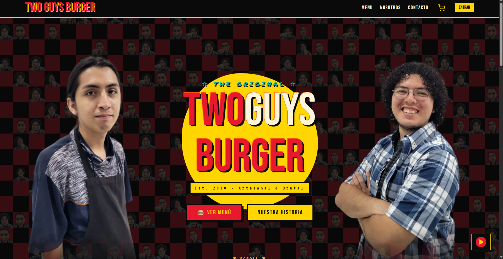
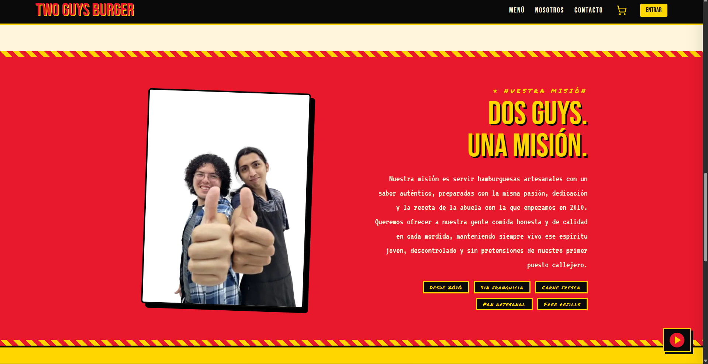
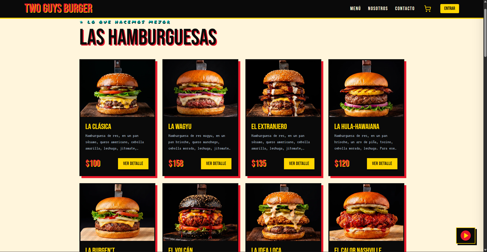
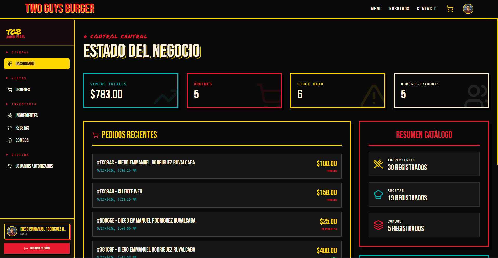
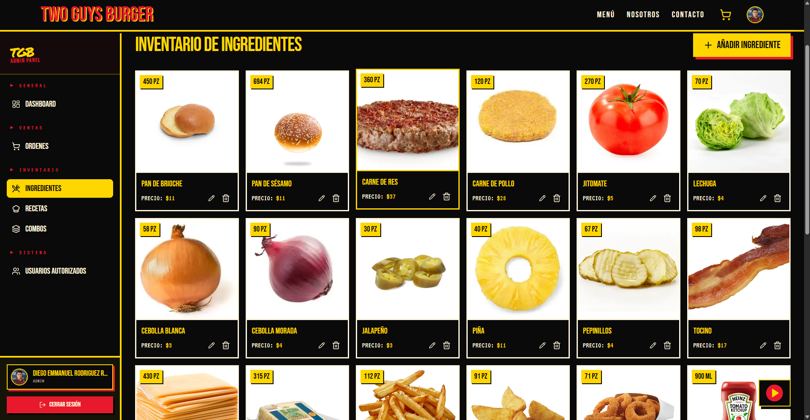

# TwoGuysBurger 🍔

> **Est. 2010 · Artesanal & Brutal**

Proyecto desarrollado para la materia de **Bases de Datos** en el sexto semestre de la carrera de Ingeniería en Computación del **Centro Universitario de la Costa (CuCosta)** de la Universidad de Guadalajara.

## 💡 La Idea

**TwoGuysBurger** no es solo un sistema de gestión de comida rápida; es una experiencia digital que captura la esencia de un puesto de hamburguesas artesanal nacido en la calle. Inspirado por la trayectoria de Alan y Jonathan, el proyecto combina una estética "punk-indie" con una arquitectura robusta para ofrecer hamburguesas con la "receta de la abuela".

Nuestra misión es servir comida honesta y de calidad, manteniendo vivo un espíritu joven y sin pretensiones, apoyado por herramientas tecnológicas modernas que facilitan tanto la compra para el cliente como la operación para el administrador.

## 🚀 Características Principales

### Para el Cliente (The Experience)
- **Menú Dinámico:** Visualización atractiva de hamburguesas artesanales y combos especiales.
- **Carrito de Compras:** Experiencia fluida para seleccionar productos y personalizar pedidos.
- **Music Player Integrado:** Una playlist curada (desde Arctic Monkeys hasta Belanova) que acompaña al usuario durante su navegación.
- **Checkout Intuitivo:** Proceso simplificado para finalizar la orden.

### Para el Administrador (The Kitchen)
- **Gestión de Inventario:** Control total sobre ingredientes y proveedores.
- **Editor de Recetas y Combos:** Herramientas para crear y modificar la oferta gastronómica en tiempo real.
- **Monitor de Pedidos:** Seguimiento de órdenes activas para una gestión eficiente de la cocina.
- **Panel de Administración:** Gestión de usuarios autorizados y configuración global.

## 🛠️ Stack Tecnológico

El proyecto utiliza una arquitectura desacoplada para maximizar el rendimiento y la escalabilidad:

- **Frontend:** [Astro](https://astro.build/) + [React](https://reactjs.org/) + [TypeScript](https://www.typescriptlang.org/). Estilizado con un sistema de diseño propio basado en Tailwind CSS.
- **Backend:** [Go (Golang)](https://go.dev/) utilizando una arquitectura limpia y eficiente con `net/http`.
- **Base de Datos:** [MongoDB](https://www.mongodb.com/) para el almacenamiento de datos transaccionales y de catálogo.
- **Servicios:** 
    - [Supabase](https://supabase.com/) para autenticación y gestión de archivos.
    - [Cloudinary](https://cloudinary.com/) para la optimización y almacenamiento de imágenes de productos.

## 🏁 Cómo Ejecutar

Para poner en marcha el proyecto localmente, sigue estos pasos:

### 1. Requisitos Previos
- [Go](https://go.dev/dl/) (v1.21 o superior)
- [Bun](https://bun.sh/) (recomendado) o Node.js
- Variables de entorno configuradas (ver archivos `.env.example` si existen)

### 2. Backend
```bash
cd backend
go run main.go
```
*El servidor correrá por defecto en el puerto `18000`.*

### 3. Frontend
```bash
cd frontend
bun install
bun dev
```
*La aplicación estará disponible en `http://localhost:5000`.*

## 🖼️ Galería

<div align="center">
   
  
  <br />
  
  
  
</div>

## 👥 Integrantes del Equipo

- **Diego Emmanuel Rodriguez Ruvalcaba**
- **Alan Engelberto Sanchez Becerra**
- **Jose Leonardo Ramirez Guizar**
- **Jonathan Javier Castillo Lara**
- **Dante Gonzales Pavon**

---

*Proyecto académico - CuCosta, UdeG.*
